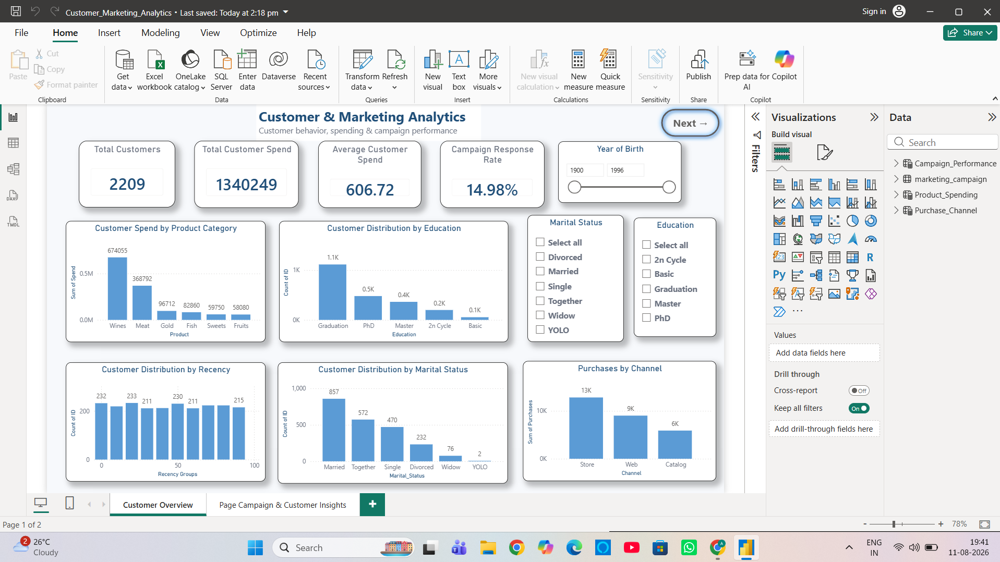
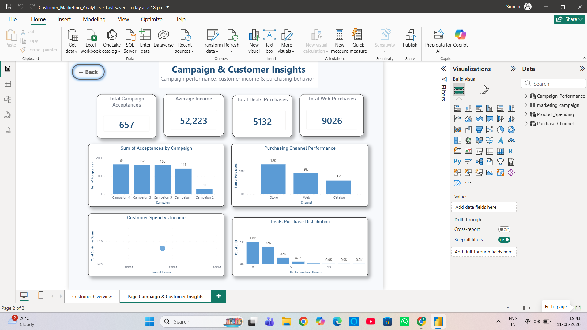

# Customer Marketing Analytics Dashboard

## 📊 Project Overview

This project presents an interactive Customer Marketing Analytics Dashboard developed using Power BI.

The dashboard analyzes customer demographics, income, purchasing behavior, campaign responses, and purchasing channels to help understand customer behavior and marketing performance.

## 🎯 Project Objective

The main objectives of this project are:

- Analyze customer purchasing behavior
- Understand customer income and spending patterns
- Track marketing campaign acceptances
- Compare purchasing channels
- Identify customer engagement patterns
- Provide meaningful business insights through interactive visualizations

## 🛠️ Tools & Technologies

- Power BI
- Power Query
- DAX
- Microsoft Excel / CSV Dataset

## 📌 Key KPIs

The dashboard includes important KPIs such as:

- Total Campaign Acceptances
- Average Income
- Total Deals Purchases
- Total Web Purchases
- Customer Spending
- Campaign Performance

## 📈 Dashboard Features

### Page 1 – Customer Overview

- Customer demographic analysis
- Income analysis
- Customer spending analysis
- Purchasing behavior
- Interactive filters and visualizations

### Page 2 – Marketing & Purchasing Analysis

- Campaign-wise acceptance analysis
- Purchasing channel performance
- Deals purchase distribution
- Customer Spend vs Income analysis
- Marketing performance comparison

## 💡 Key Insights

The dashboard helps identify:

- Customer purchasing patterns
- Relationship between income and spending
- Most effective marketing campaigns
- Preferred purchasing channels
- Customer engagement with marketing campaigns

## 📷 Dashboard Preview

### Page 1

### Page 2

## 📂 Project Files

- `Customer_Marketing_Analytics.pbix` – Power BI dashboard file
- `Dashboard.png` – Dashboard Page 1
- `Dashboard_Page2.png` – Dashboard Page 2
- Dataset CSV – Source dataset used for analysis

## 🚀 Conclusion

This project demonstrates the use of Power BI to transform customer and marketing data into an interactive business intelligence dashboard.

It showcases skills in data visualization, data analysis, dashboard design, Power Query, and DAX.
